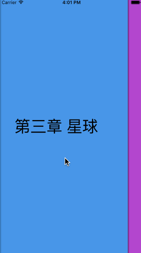
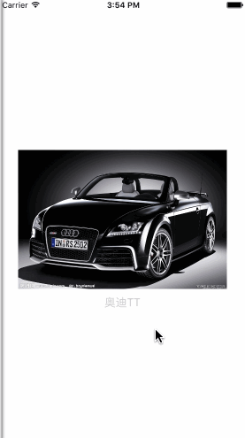

# BookEffectDemo

## 描述
这是一个利用简单的效果实现的翻页效果 Demo。

## 怎样使用
1、 Download 整个项目；
2、 将 SLBooksView 添加到自己项目中；
3、 定义 SLBooksView，并实现 dataSource 代理方法：

```objc
@protocol BooksViewDataSource <NSObject>
@required
- (PageView *)booksView:(SLBooksView *)booksView pageViewBeforePageView:(PageView *__nullable)pageView;

- (PageView *)booksView:(SLBooksView *)booksView pageViewAfterPageView:(PageView *)pageView;

- (NSInteger)numberOfPageInBooksView:(SLBooksView *)booksView;
@end

```

4、 根据数据类型需求，定义至少一个 PageView 的子类实例（如果超过三页且style一样则定义三个用于重用的 PageView 即可）；

详细可以见 Demo 代码。

## 效果图
<p align="center" style="color:gray">
    
	一种类型的 Page
</p>

<p align="center" style="color:gray">
    
	两种类型的 Page
</p>

## 许可

**BookEffect** is available under the MIT license. See the LICENSE file for more info.